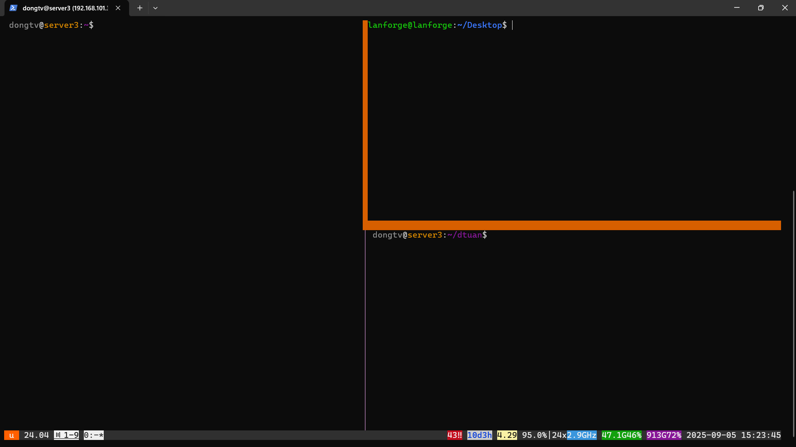

# HƯỚNG DẪN ĐO ĐẠC CPU_USAGE, LATENCY
## 1. Truy cập server3 bằng tailscale
- Click vào link trên để truy add server3 vào node tailscale của mình.
- Sử dụng lệnh sau để ssh vào server3: 
```bash
    ssh dongtv@<IP server3>
```
- Mật khẩu server3 và lanforge: 1

## 2. Điều chỉnh trong code:
- Truy cập vào server3, kiểm tra xem đang nằm ở branch nào:
```bash
    cd dtuan/xdp-program
    git branch
```
- Chuyển sang branch mình muốn đo. Mình sẽ đo 2 thuật toán chính: supervised_lof, knn_threshold
```bash
    git switch supervised_lof / git switch knn_threshold
```
- Sau khi vào branch đấy, chạy lệnh sau:
```bash
    make
```
- Có thể thay đổi các thông số trong file `common_kern_user.h` như sau: `KNN`, `LOF_THRESOLD`. Nhưng đối với việc đo cpu_usage, latency thì không thay đổi gì.

## 3. Chi tiết về testbed
- Sau khi ssh vào server3, bật byobu để hiển thị màn hình làm việc:
```bash
    byobu
```
- Màn hình hiển thị lên có 3 khung, có thể click chuột vào mỗi khung: 


- Đầu tiên chạy lệnh sau ở khung bên trái:
```bash
    ./dtuan/run_xdp_program.sh
```
- Sau khi xong, bật tcpdump ở khung bên phải phía dưới với lệnh sau:
```bash
    sudo tcpdump -i eno3
```
- Sau khi xong, phát tập benign với khung bên phải phía trên (Làm việc trên lanforge và ở thư mục Desktop, nếu chưa trong thư mục Desktop --> cd Desktop)
```bash
    sudo tcpreplay --mbps=1 -i enp1s0f1 --limit=920 test/benign_file.pcap
```
- Đợi chạy xong phát tập benign, vì để 1 mbps và phát 920 gói nên rất nhanh. Sau khi xong thì phát tấn công trong 60s với lệnh sau:
```bash
    ./replay_60s.sh enp1s0f1 test/attack_file.pcap [packet/s]
```
- Lưu ý: Ở đây có thể thay đổi pps nếu không set gì thì mặc định là 10000 pps. Có thể thay đổi như sau:
```bash
    ./replay_60s.sh enp1s0f1 test/attack_file.pcap 100
```
- Tức là 100pps
## 4. Tiến hành đo cpu_usage:
- Mở một terminal khác ssh vào server3, sau đó thực hiện lệnh sau:
```bash
    cd dtuan
    ./cpu_usage_estimate.sh cpu_usage_lof_10k.csv 60
```
Một lưu ý ở đây là tên file output cpu_usage_lof_10k.csv chỉ là ví dụ, phải đặt tên như sau: cpu_usage_<loại thuật toán đang đo>_<packet/s đang phát>.csv, thời gian đo bắt buộc là 60.

## 5. Tiến hành đo latency:
- Mở tiếp một terminal khác ở máy, ssh vào server3, sau đó thực hiện các lệnh sau (Nếu hỏi mật khẩu thì mật khẩu là 1):
```bash
    ssh lanforge@192.168.101.238
    ssh gnb@192.168.50.3
    ./latency_test.sh enp1s0 192.168.50.4 60 latency_lof_10k.csv
```
Một lưu ý ở đây là tên file output latency_lof_10k.csv chỉ là ví dụ, phải đặt tên như sau: latency_<loại thuật toán đang đo>_<packet/s đang phát>.csv, thời gian đo bắt buộc là 60.

## 6. Kịch bản đo:
- Đối với việc đo cpu_usage, latency thì đã cố định trong code, chỉ cần chạy lệnh thôi là được. Thay đổi số pps từ 10k đến khi đơ XDP, đến mức xdp bị đơ (Mỗi lần tăng 10k).
