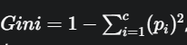
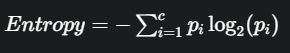
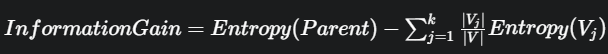

# Cây Quyết Định (Decision Tree)

## 1. Định nghĩa

- Cây quyết định giúp chúng ta đưa ra quyết định bằng cách mô tả các lựa chọn khác nhau và kết quả có thể xảy ra.  
- Decision Tree đưa ra quyết định bằng cách thể hiện các lựa chọn và mối quan hệ giữa chúng.  
- Nó có cấu trúc giống như một cái cây, bắt đầu với một câu hỏi chính gọi là **nút gốc (root node)**, đại diện cho toàn bộ tập dữ liệu.  

### Các thành phần của cây:
- **Root node (nút gốc):** Điểm bắt đầu, biểu diễn toàn bộ dữ liệu.  
- **Branches (các nhánh):** Đường nối giữa các nút, thể hiện dòng chảy của quyết định.  
- **Internal nodes (nút trong):** Điểm nơi đưa ra quyết định dựa trên đặc trưng dữ liệu.  
- **Leaf nodes (nút lá):** Điểm cuối của cây, nơi đưa ra dự đoán hoặc quyết định cuối cùng.  

### Các loại cây quyết định:
- **Cây phân loại (Classification Tree):**  
  Dùng để dự đoán kết quả dạng phân loại, ví dụ: email *spam* hay *không spam*.  
  Cây này tách dữ liệu dựa trên đặc trưng để phân loại vào các nhóm đã xác định.  

- **Cây hồi quy (Regression Tree):**  
  Dùng để dự đoán giá trị liên tục, ví dụ: dự đoán giá nhà.  
  Thay vì gán nhãn, nó đưa ra giá trị số dựa trên đặc trưng đầu vào.  

---

## 2. Cách hoạt động của Decision Tree

1. **Bắt đầu từ nút gốc:** Cây bắt đầu với một câu hỏi chính tại nút gốc, được rút ra từ các đặc trưng trong tập dữ liệu.  
2. **Đặt câu hỏi Yes/No:** Từ nút gốc, cây đặt một loạt câu hỏi dạng có/không để chia dữ liệu thành các tập con dựa trên đặc trưng cụ thể.  
3. **Phân nhánh dựa trên câu trả lời:**  
   - Nếu *Yes* → đi theo một nhánh.  
   - Nếu *No* → đi theo nhánh khác.  
4. **Tiếp tục phân chia:** Quá trình phân nhánh tiếp tục với các câu hỏi tiếp theo, giúp thu hẹp dữ liệu từng bước.  
5. **Đến nút lá:** Quá trình kết thúc khi không còn câu hỏi hữu ích nào để tách, lúc đó ta đến nút lá – nơi quyết định hoặc dự đoán cuối cùng được đưa ra.  

---

## 3. Tiêu chí phân chia trong Decision Tree

Trong cây quyết định, quá trình chọn cách chia dữ liệu tại mỗi nút rất quan trọng.  
Tiêu chí phân chia tìm ra đặc trưng tốt nhất để tách dữ liệu.  

### Các tiêu chí phổ biến:

- **Gini Impurity (Độ nhiễm bẩn Gini):**  
  - Tính xác suất mà hai phần tử được chọn ngẫu nhiên từ cùng một nhóm có nhãn khác nhau.  
  - Gini = 0 → nhóm hoàn toàn thuần khiết (chỉ có một loại nhãn).  
  - Gini cao → nhóm pha trộn nhiều nhãn.  
  - 
  - pi là tỷ lệ của lớp thứ i trong tập giữ liệu con và c là số lớp.

- **Entropy (Độ hỗn loạn):**  
  - Đo lường mức độ không chắc chắn hay hỗn loạn trong dữ liệu.  
  - Cây quyết định sẽ cố gắng giảm entropy bằng cách chọn đặc trưng giúp “giải thích” nhãn mục tiêu tốt nhất.  
    
- Cả 2 tiêu chí trên đều tuân theo nguyên tắc: tìm cách giảm thiểu sự không thuần khiết sau khi phân tách.

---

## 4. Quá trình phân tách:
- Quá trình lặp đi lặp lại tại mỗi nút của cây:
- **Tính toán Gini/Entropy cho nút hiện tại:** Đầu tiên, tính toán giá trị Gini Impurity hoặc Entropy cho nút cha trước khi phân tách.
- **Đánh giá từng đặc trưng:** Với mỗi đặc trưng có thể có, cây quyết định sẽ thử phân tách dữ liệu dựa trên các giá trị của đặc trưng đó. Sau đó, nó sẽ tính toán Gini hoặc Entropy trung bình có trọng số cho các nút con được tạo ra.
    + Gini Gain/Information Gain: Cây quyết diudnhj không chỉ nhìn vào giá trị Gini/Entropy của các nút con, mà còn tính toán mức độ gairm của Gini/Entropy sau khi phân tách. Mức giảm này được gọi là Gini Gain (hoặc Information Gain khi sử dụng Entropy).\
    
- **Chọn đặc trưng tốt nhất:** Đặc trưng nào mang lại Information Gain lớn nhất (tức là làm giảm Entropy/Gini nhiều nhất) sẽ được chọn làm điểm phân tách tại nút đó.
- **Phân tách và lặp lại:** Dữ liệu sẽ được phân chia thành các tập con dựa trên đặc trưng đã chọn, và quá trình này được lặp lại cho mỗi nút con mới cho đến khi cây đạt đến một tiêu chí dừng nào đó (các nút hoàn toàn thuần khiết, hoặc số lượng nút tối đa).

---
## 5. Cắt tỉa trong cây quyết định:
- Cắt tỉa được dùng để ngừa overfitting trong DT. Overfitting xảy ra khi 1 cây trở nên quá sâu và bắt đầu học thuộc lòng dữ liệu huấn luyện thay vì học các quy luật chung.
- Kỹ thuật này giúp giảm độ phức tạp của cây bằng cách loại bỏ các nhánh có ít khả năng dự đoán. Nó cải thiện hiệu suất mô hình bằng cách giúp cây khái quát hóa tốt hơn với dữ liệu mới. Ngoài ra, nó giúp mô hình đơn giản hơn và triển khai nhanh hơn.
- Tỉa cây rất hữu ích khi một cây quyết định quá sâu và bắt đầu nắm bắt cả những nhiễu trong dữ liệu.

---

# Random Forest
## 1. Giới thiệu chung:
- Là thuật toán học máy sử dụng nhiều cây quyết định để đưa ra dự đoán tốt hơn. Mỗi cây xem xét các phần ngẫu nhiên khác nhau của dữ liệu và kết quả của chúng được kết hợp bằng cách bỏ phiếu cho phân loại (Classification) hoặc tính trung bình cho hồi quy (Regression) --> Tạo nên một kỹ thuật học tổng hợp.
## 2. Hoạt động của thuật toán Random Forest:
1. **Tạo nhiều cây quyết định:** Thuật toán tạo ra nhiều cây quyết định, mỗi cây sử dụng một phần dữ liệu ngẫu nhiên.
2. **Chọn tính năng ngẫu nhiên:** Khi xây dựng mỗi cây, nó không xem xét tất cả các tính năng (cột) cùng một lúc. Chọn ngẫu nhiên một vài tính năng để quyết định phân chia dữ liệu.
3. **Mỗi cây đưa ra một dự đoán:** Mỗi cây sẽ đưa ra 1 câu trả lời hoặc dự đoán riêng dựa trên những gì nó học được từ phần dữ liệu của mình.
4. **Kết hợp các dự đoán:**
  + **Classification:** Chọn một danh mục vì câu trả lời cuối cùng là câu trả lời mà hầu hết các cây đều đồng ý.
  + **Regression:** Dự đoán 1 số là trung bình của tất cả các dự đoán.

## 3. Giả định của Random Forest:
- Mỗi cây tự đưa ra quyết định của riêng mình: Mỗi cây trong rừng đều tự đưa ra dự đoán của riêng mình mà không cần dựa vào cây khác.
- Các phần dữ liệu ngẫu nhiên được sử dụng.
- Cần có đủ dữ liệu.
- Các dự đoán khác nhau cải thiện độ chính xác.

---
# Rừng cô lập (Isolation Forest)
## 1. Giới thiệu chung:
- Là một thuật toán xác định các điểm ngoại lệ trong tập dữ liệu lớn bằng cách cô lập chúng thông qua phân cùng nhị phân, vốn đòi hỏi chi phí tính toán tối thiểu.
## 2. Các khái niệm chính:

1. **Cô lập:** Thuật toán cô lập các điểm bất thường bằng cách tập trung vào sự khác biệt của chúng so với các điểm dữ liệu thông thường thay vì điểm tương đồng.
2. **Phân vùng:** Dữ liệu được phân chia bằng cách chọn ngẫu nhiên các đặc điểm và sử dụng các giá trị ngẫu nhiên để phân vùng dữ liệu.
3. **Điểm bất thường:** Đo lường mức độ dễ dàng phân tác một điểm dữ liệu. Các điểm cần ít lần phân tán hơn để phân tách được coi là bất thường và được gán điểm cao hơn.

## 3. Hoạt động của thuật toán isolation forest:
- Hoạt động thông qua quy trình phân vùng đệ quy, tạo ra nhiều cây quyết định xác định các điểm bất thường.
1. **Phân vùng ngẫu nhiên:** Bắt đầu bằng cách chọn một tính năng ngẫu nhiên từ tập dữ liệu. Sau đó chia dữ liệu theo giá trị ngẫu nhiên trong phạm vi của tính năng đó, chia làm 2 phần. Lặp lại theo đệ quy, tạo ra cây nhị phân trong đó mỗi nhánh biểu diễn một phần chia tách trong dữ liệu.

2. **Đường dẫn cô lập:** Đề cập đến số lần phân tách cần thiết để cô lập một điểm dữ liệu. Các điểm bất thường có đường đi ngắn hơn vì chúng ở xa phần dữ liệu hơn, do đó cần ít lần phân tách hơn để tách chúng.

3. **Quần thể cây:** Thay vì dựa vào 1 cây duy nhất, nó xây dựng 1 tập hợp các cây. Mỗi cây được tạo độc lập với các phân tách ngẫu nhiên, giúp tạo ra đường cô lập đa dạng cho mỗi điểm dữ liệu trên nhiều cây.\
==> Đảm bảo tinh mạnh mẽ và độ tin cậy của kết quả.

4. **Điểm số bất thường:** Điểm bất thường cho mỗi điểm dữ liệu được tính bằng cách lấy trung bình độ dài đường dẫn trên tất cả các cây. Đường đi ngắn hơn (ít phân tách hơn) cho thấy điểm đó có nhiều khả năng là điểm bất thường.

5. **Phân loại:** Để phân loại các điểm dữ liệu là bình thường hay bất thường, thuật toán đặt ngưỡng cho điểm bất thường. Các điểm trên ngưỡng được phân loại là bất thường, trong khi các điểm dưới ngưỡng được coi là bình thường.