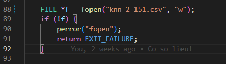

# HƯỚNG DẪN ĐO ĐẠC CPU_USAGE, LATENCY
## 1. Truy cập server3 bằng tailscale
- Click vào link trên để truy add server3 vào node tailscale của mình.
- Sử dụng lệnh sau để ssh vào server3: 
```bash
    ssh dongtv@<IP server3>
```
- Mật khẩu server3 và lanforge: 1

## 2. Switch giữa các branch trong code (Làm ở VS code):
- Truy cập vào server3, kiểm tra xem đang nằm ở branch nào:
```bash
    cd dtuan/xdp-program
    git branch
```
- Chuyển sang branch mình muốn đo. Mình sẽ đo 2 thuật toán chính: supervised_lof, knn_threshold
```bash
    git switch supervised_lof / git switch knn_threshold
```
- Sau khi vào branch đấy, chạy lệnh sau:
```bash
    make
```
- Có thể thay đổi các thông số trong file `common_kern_user.h` như sau: `KNN`, `LOF_THRESOLD`.

## 3. Đo accuracy của KNN:
- Điều chỉnh `KNN` chạy từ 2 -> 5. Hình như 6 là không load được vào XDP, chỉnh đến khi không load được vào XDP thì dừng.
- Điều chỉnh `DIST_THRESHOLD` từ 15->20 nhảy 1 đơn vị cho 1 lần điều chỉnh.
- Điều chỉnh `WARM_UP_FOR_KNN` từ 100 - 500 bước nhảy 20 --> Phải điều chỉnh `MAX_FLOW_SAVED` để đảm bảo có 100 test.

### KỊCH BẢN ĐO:
#### Đo accuracy với `KNN` và `DIST_THRESHOLD`
- Điều chỉnh trong VS Code:
    + Vào file `common_kern_user.h` để điều chỉnh `KNN` và `DIST_THRESHOLD`. Với mỗi giá trị `KNN` thì điều chỉnh `DIST_THRESHOLD` từ 15 -> 20. Ở đây thì mặc định `WARM_UP_FOR_KNN` = 100 và `MAX_FLOW_SAVED` = 200.
    + Vào file `dump_map_to_csv.c` để điều chỉnh tên file csv lưu ra. Tìm đến ảnh:
    
    + Điều chỉnh xong thì dùng lệnh sau ở terminal:
    ```bash
        make
    ```


- Mở cmd, ssh vào server3 sau đo bật byobu nhìn thấy màn hình byobu, thực hiện các yêu cầu sau:
+ Ở màn hình bên trái chạy lệnh sau:
```bash
    cd
    ./dtuan/run_xdp_program.sh
```
+ Ở màn hình bên phải dưới, chạy:
```bash
    sudo tcpdump -i eno3
```
+ Ở màn hình bên phải trên, phát tcpreplay với thứ tự như sau:
```bash
    cd Desktop/pcap
    sudo tcpreplay -i eno3 --mbps=1 --limit=<...> benign_file.pcap
    sudo tcpreplay -i eno3 --mbps=1 attack_file.pcap
```